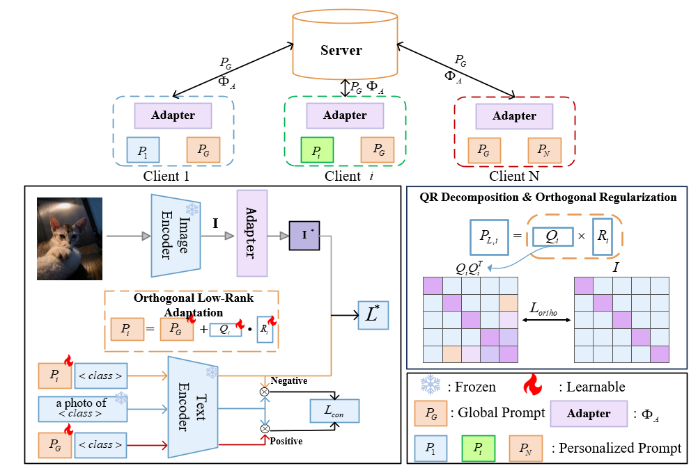

# FLORA: Better Balance Between Generalization and Personalization in Multi-Modal Federated Prompt Learning
Here is the official implementation of the model FLORA.

## Abstract
Federated Prompt Learning (FPL) leverages the robust representation learning and remarkable generalization ability of large pre-trained Vision-Language Models (VLMS) into federated learning through prompt learning. Existing FPL methods attempt to address data heterogeneity via model personalization. However, excessive personalization leads to the compromise of model’s generalization ability, which remains a significant challenge to achieve a balance between personalization and generalization under high data heterogeneity. To address this challenge, we propose FLORA, a novel framework that combines orthogonal low-rank adaptation withattention-guided client adapter. Specifically, each client personalizes global prompt through orthogonal low-rank adaptation term, thereby achieving efficient local adaptation while maintaining the generalization of the global prompt. In addition, we introduce a lightweight attention-based adapter for the image encoder, which can enhance cross-modal alignment under nonindependent and nonidentically distributed (Non-IID) environment to further achieve the balance. Extensive experiments on multiple datasets demonstrate that our FLORA achieves superiority performance in balancing generalization and personalization over state-of-the-art methods under high data heterogeneity.

## Setup
### requirement
The required packages are listed in requirements.txt for requirement 
```
pip install -r requirements.txt
```

## Datasets:
Please follow the instructions at CoOP https://github.com/KaiyangZhou/CoOp/blob/main/DATASETS.md to prepare the following datasets: Caltech101, OxfordPets, Flowers102, Food101, DTD.

For CIFAR10 and CIFAR100 datasets, please download and unzip data under DATA/ file catalog. Or simply run experiments with CIFAR10/CIFAR100 dataset, the program will download data automatically.

For DomainNet and office-caltech10 datasets, please follow the instructions of Dataset described here .

## Training:

* Train source models (shown here for Office-31 with source A)

```shell
python train_source.py --dset office-31 --s 1 --t 0 --max_epoch 100 --trte val --gpu_id 0 --output ckps/source/
```

* Adapt to target domain (shown here for Office-31 with target D)
```shell
python train_target.py --dset office-31 --t 1 --max_epoch 15 --gpu_id 0 --cls_par 0.7 --crc_par 0.01 --crc_mse 0.01 --output_src ckps/source/ --output ckps/DFM
```
